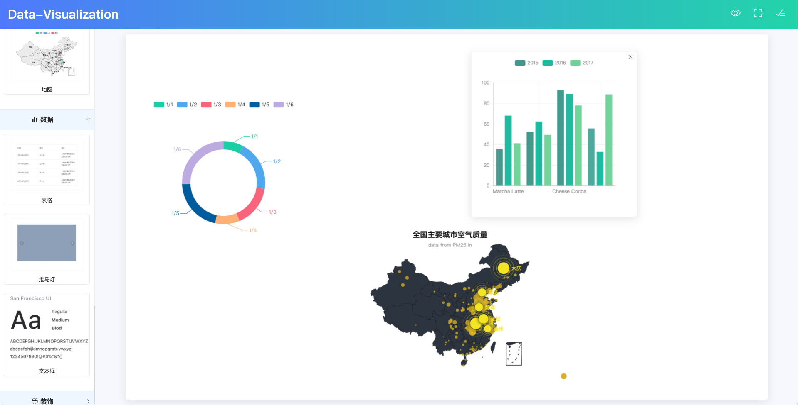
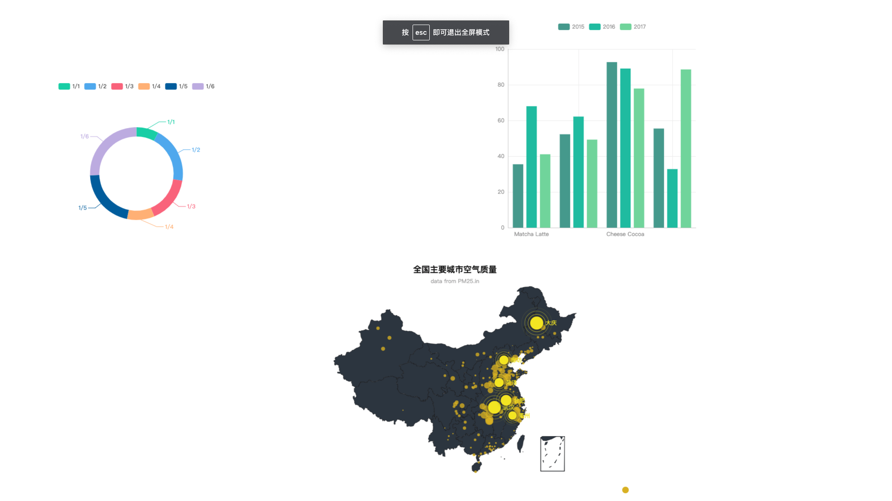

# data-visualization :bar_chart:

可拖拽配置的可视化监控视图，易与扩展 

目前只完成了拖拽组件的配置及组件的拖放与放大缩小，视图的预览功能。后面会增加单独组件的属性修改配置与添加后端

## 依赖组件及插件

- Element 用于搭建基本框架及部分拖拽组件的引用(图片、走马灯拖拽组件)
- v-charts 图形拖拽组件使用，因简化了echarts的配置，非常好使
- vue-charts 图形拖拽组件，当v-charts满足不了需求时使用，相当于原生的echarts
- echarts 原生echarts，上面两个图形组件都有依赖到，也可使用echarts自定义组件
- InteractJs 适用于现代浏览器的js拖放、调整大小的库


## 效果展示

### 配置视图




### 视图预览(全屏)




## 运行

- 把项目clone到本地

- 安装依赖

  ```
  npm install
  ```

- 运行及查看

  ```
  npm run serve
  ```

  访问：localhost:8080/home


